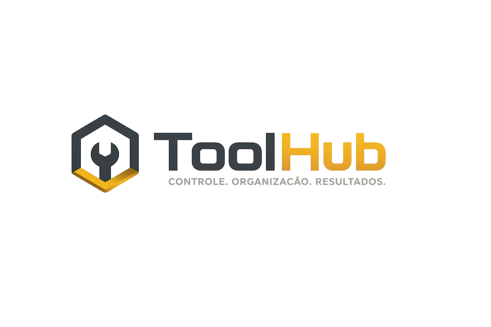

<p align="center">
  
</p>

<h1 align="center">ToolHub</h1>

<p align="center">
Sistema Inteligente para Gerenciamento de Ferramentas
</p>

<p align="center">
Aplicação desenvolvida para digitalizar o gerenciamento de ferramentas em laboratórios, oficinas, almoxarifados e ambientes educacionais.
</p>

<p align="center">

<a href="#sobre">Sobre</a> •
<a href="#problema">Problema</a> •
<a href="#solucao">Solução</a> •
<a href="#funcionalidades">Funcionalidades</a> •
<a href="#tecnologias">Tecnologias</a> •
<a href="#instalacao">Instalação</a>

</p>

---

# 📖 Sobre

O **ToolHub** é uma aplicação web desenvolvida para digitalizar e otimizar o gerenciamento de ferramentas em laboratórios, oficinas, almoxarifados e ambientes educacionais.

O sistema substitui controles realizados em papel ou planilhas por uma plataforma moderna, proporcionando:

- rastreabilidade completa das ferramentas;
- organização dos processos;
- redução de perdas operacionais;
- maior confiabilidade das informações.

Este projeto foi desenvolvido como Trabalho de Conclusão de Curso (TCC) do curso **Técnico em Desenvolvimento de Sistemas** do **SENAI Anchieta**.

---

# ⚠ Problema

Em muitos laboratórios e oficinas ainda é comum encontrar processos como:

- controle manual;
- empréstimos registrados em papel;
- ausência de histórico;
- dificuldade para localizar ferramentas;
- perdas e extravios;
- falta de indicadores.

Esses fatores comprometem a produtividade e dificultam a gestão dos recursos.

---

# 💡 Nossa solução

O **ToolHub** centraliza todas essas operações em uma única plataforma, permitindo:

- gerenciamento de ferramentas;
- controle de empréstimos;
- registro de devoluções;
- histórico completo de movimentações;
- registro de ocorrências;
- gerenciamento de usuários;
- diferentes níveis de acesso.

---

# 🚀 Funcionalidades

### 🔐 Login

Autenticação integrada ao backend.

### 📊 Dashboard

Visualização rápida das principais informações do sistema.

### 🛠 Gerenciamento de Ferramentas

- cadastro;
- consulta;
- atualização;
- disponibilidade.

### 📦 Empréstimos

Controle completo das retiradas das ferramentas.

### 📜 Histórico

Consulta de todas as movimentações realizadas.

### ⚠ Ocorrências

Registro de danos, perdas e demais problemas encontrados.

### 👤 Perfil

Gerenciamento das informações do usuário autenticado.

---

# 🛠 Tecnologias Utilizadas

## Frontend

- React
- Create React App
- JavaScript
- Material UI
- React Router DOM
- CSS3

## Backend

- Spring Boot
- Java
- JWT
- REST API

## Banco de Dados

- PostgreSQL (Produção)
- H2 Database (Desenvolvimento)

## Deploy

- Firebase Hosting
- Render

---

# 📂 Estrutura do Projeto

```text
src
│
├── components
│   └── Layout.jsx
│
├── pages
│   ├── Login.jsx
│   ├── DashboardInicio.jsx
│   ├── Ferramentas.jsx
│   ├── EmUso.jsx
│   ├── Historico.jsx
│   ├── Ocorrencias.jsx
│   ├── Perfil.jsx
│   ├── CadastrarPerfil.jsx
│   └── ListarPerfis.jsx
│
├── apiConfig.js
├── App.jsx
└── index.js
```

---

# 🏗 Arquitetura

```text
            Usuário
               │
               ▼
      React + Material UI
               │
               ▼
      REST API (Spring Boot)
               │
               ▼
         PostgreSQL
```

---

# 💻 Como executar

Clone o repositório

```bash
git clone https://github.com/SENAI-Anchieta-DEV/dmmps-gerenciador-de-ferramentas-frontend.git
```

Entre na pasta

```bash
cd dmmps-gerenciador-de-ferramentas-frontend
```

Instale as dependências

```bash
npm install
```

Execute o projeto

```bash
npm start
```

---

# 🌐 Deploy

Frontend publicado em:

https://toolhub-frontend.web.app

---

# 🔗 Integração

O frontend consome uma API REST desenvolvida em Spring Boot responsável por:

- autenticação;
- gerenciamento de usuários;
- gerenciamento de ferramentas;
- empréstimos;
- ocorrências;
- histórico.

---

# 🚧 Futuras Melhorias

- notificações em tempo real;
- integração com QR Code;
- integração com RFID;
- dashboard analítico;
- relatórios em PDF;
- aplicativo mobile;
- integração com dispositivos IoT.

---

# 👥 Equipe

Projeto desenvolvido pelos alunos do curso **Técnico em Desenvolvimento de Sistemas** do **SENAI Anchieta**.

---

# 📄 Licença

Projeto desenvolvido exclusivamente para fins acadêmicos.